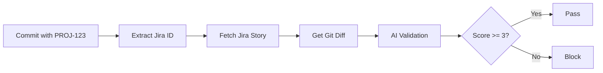

# AI Intent Tracker with Jira Integration

> Automatically validate that code changes match Jira story requirements using AI. Prevent scope creep and ensure developers work on what they committed to.

[](https://www.python.org/downloads/)
[](https://opensource.org/licenses/MIT)

---

## The Problem

- **Scope Creep**: Developers working on PROJ-123 but changing unrelated code
- **Difficult Reviews**: Managers can't tell if PR matches the Jira story
- **Lost Context**: Code changes don't align with ticket requirements
- **Compliance**: No audit trail linking code to business requirements

## The Solution

AI Intent Tracker validates every commit against Jira stories:
1. **Git Hook**: Automatically validates commits before they're made (optional)
2. **Jira Integration**: Extracts intent from Jira story descriptions
3. **AI Validation**: Checks if code changes match the story (0-10 score)
4. **PR Reports**: Manager sees alignment scores before approving

## Key Features

- **Jira Story Validation** - Automatic intent from Jira tickets
- **Pre-commit Hooks** - Block misaligned commits before they happen (optional)
- **AI-Powered Analysis** - GPT-4 validates code vs story requirements
- **PR Dashboard** - Manager-friendly validation reports
- **Scope Creep Detection** - Catches unrelated changes automatically
- **Zero Friction** - Works with existing git workflow
- **Security Scanning** - AI-powered vulnerability detection

---

## Quick Start (5 Minutes)

### 1. Install (1 min)
```bash
git clone https://github.com/yourusername/intent_aware_git.git
cd intent_aware_git
pip install -r requirements.txt
pip install -e .
```

### 2. Configure Jira (2 min)
```bash
# Copy template
cp .env.example .env

# Edit .env with your credentials:
# JIRA_URL=https://yourcompany.atlassian.net
# JIRA_EMAIL=you@company.com
# JIRA_API_TOKEN=<your_token>
# OPENAI_API_KEY=<your_key>
```

Get Jira API token: https://id.atlassian.com/manage-profile/security/api-tokens

### 3A. Server-Side Only (Zero Setup)
```bash
# Add .github/workflows/pr-summary.yml to your repo
# Add secrets to GitHub repo settings
# Done! Validation happens automatically on PRs
```

### 3B. Client-Side (Optional - For Instant Feedback)
```bash
cd /path/to/your/project
intent install-hooks
```

### 4. Use It
```bash
# Make changes
git add .

# Commit with Jira ID
git commit -m "PROJ-123: Add OAuth authentication"

# With hook: validates immediately
# Without hook: validates on PR (GitHub Action)
```

---

## How It Works

### Two-Tier Architecture

#### Tier 1: Server-Side (Always Active)
```
Developer → commit → push → PR → GitHub Action validates → Manager reviews
                                   ↑ Zero setup, can't bypass
```

**What Happens:**
1. Developer commits with Jira ID: `PROJ-123: Add feature`
2. Pushes to GitHub
3. GitHub Action automatically:
   - Extracts PROJ-123
   - Fetches story from Jira
   - Validates with AI
   - Posts report as PR comment
   - Sets status check (pass/fail)
4. Manager reviews before merge

#### Tier 2: Client-Side (Optional)
```
Developer → commit → pre-commit hook validates → instant feedback
```

**What Happens:**
1. Developer installs hook: `intent install-hooks`
2. On commit, hook:
   - Extracts Jira ID
   - Fetches story
   - Validates with AI
   - Blocks if score < 3/10
3. Developer gets instant feedback

### Validation Flow



---

## Developer Workflow

### Regular Developer (No Setup)
```bash
# 1. Work on Jira story
# 2. Make changes
git add .

# 3. Commit normally with Jira ID
git commit -m "PROJ-456: Add OAuth2 login button"

# 4. Push
git push origin feature-branch

# 5. Create PR
# → GitHub Action validates automatically
# → Posts alignment report
```

### Power User (With Hook)
```bash
# One-time setup
intent install-hooks

# Then commit as normal
git commit -m "PROJ-456: Add OAuth2 login button"

# → Hook validates immediately (5 seconds)
# → Get instant feedback
# → GitHub Action still validates on PR
```

---

## Manager Workflow

### Review PR with Auto-Generated Report

```
Pull Request #234: "Add OAuth and fix styling"

Status Checks:
[PASS] intent-validation - Passed

Comment from AI Intent Tracker:
---
## Jira Story Validation Report

### PROJ-123: Add OAuth2 authentication
**Alignment Score:** 9/10 (Confidence: 95%)
**Status:** aligned
**Key Functionality Present:** Yes

**What Aligns:**
- OAuth2 flow implementation present
- Token validation logic added
- Proper error handling included

**Suggestions:**
- Consider adding unit tests for token refresh

### Summary
- Average Score: 9.0/10
- Stories Validated: 1
- Critical Issues: 0
```

**Manager Actions:**
- Approve (high score)
- Review carefully (medium score)
- Request changes (low score)

---

## Example Output

### Pre-commit Hook Output
```
[INFO] Validating commit against Jira story...
[SUCCESS] Found Jira ID: PROJ-123
[INFO] Fetching Jira story PROJ-123...
[SUCCESS] Story: Add OAuth2 authentication
Type: Story | Status: In Progress

[ANALYSIS] Intent Alignment:
   Score: 9/10 | Confidence: 95% | Status: aligned
   [OK] Key functionality present
   [OK] GOOD alignment

   [MATCHES] What aligns:
      • OAuth2 flow implementation present
      • Token validation logic added
      • Proper error handling included

[SUCCESS] Commit validation passed!
```

### Scope Creep Detection
```
[CRITICAL] MISMATCH - Code does NOT implement stated intent!
   Score: 2/10 [FAIL]

   [WARNING] Discrepancies:
   • Story says "fix styling" but OAuth system was refactored
   • Database schema changes not mentioned in story
   • Auth configuration modified - out of scope

   [SUGGESTIONS]
   • Split into multiple stories
   • Current changes should be PROJ-790, PROJ-791
   • Only style changes belong in PROJ-789

[BLOCKED] Commit blocked due to alignment < 3/10
```

---

## Use Cases

### 1. Scope Creep Detection
**Story:** PROJ-789: Fix login button styling  
**What Developer Changed:**
- LoginButton.css (expected)
- AuthSystem.js (unexpected)
- database/schema.sql (unexpected)

**Result:** Score 2/10 → Blocked → Developer splits into proper stories

### 2. Multi-Story PR
```bash
git commit -m "PROJ-100: Add user profile page"
git commit -m "PROJ-101: Add profile photo upload"
git commit -m "PROJ-102: Add profile edit form"
```

**Result:** Each story validated separately, granular feedback per story

### 3. Emergency Bypass
```bash
# Production hotfix
SKIP_INTENT_VALIDATION=1 git commit -m "HOTFIX: Fix crash"
```

---

## Project Structure

```
ai-intent-tracker/
│
├── cli/                     # Python CLI code
│   ├── commands.py          # CLI commands
│   ├── jira_client.py       # Jira API integration
│   ├── ai_validator.py      # AI validation logic
│   ├── install_hooks.py     # Git hook installer
│   └── utils.py             # Helpers
│
├── hooks/
│   └── pre-commit           # Git pre-commit hook
│
├── .github/
│   └── workflows/
│       └── pr-summary.yml   # PR validation action
│
├── tests/                   # Unit tests
├── README.md
├── requirements.txt
└── setup.py
```

---

## Configuration

### Environment Variables

```bash
# Required for Jira integration
JIRA_URL=https://yourcompany.atlassian.net
JIRA_EMAIL=you@company.com
JIRA_API_TOKEN=your_token_here

# Required for AI validation
OPENAI_API_KEY=your_openai_key

# Optional: Control validation behavior
ENABLE_AI_VALIDATION=true
SKIP_INTENT_VALIDATION=false
```

### GitHub Secrets (For PR Validation)

Add these to your repository settings:
- `JIRA_URL`
- `JIRA_EMAIL`
- `JIRA_API_TOKEN`
- `OPENAI_API_KEY`

### Make Validation Required

```
Repository Settings → Branches → main → 
☑️ Require status checks to pass
☑️ intent-validation
```

Now PRs can't be merged without passing validation!

---

## Benefits by Role

### For Developers
- Catch scope creep early
- Learn from AI suggestions
- Clear definition of "on-task"
- Optional instant feedback

### For Managers
- See alignment before review
- Block scope creep automatically
- Save review time
- Data-driven decisions

### For Teams
- Reduce wasted development time
- Improve estimate accuracy
- Compliance audit trail
- Better sprint execution

---

## Troubleshooting

### "Jira authentication failed"
- Check JIRA_EMAIL and JIRA_API_TOKEN in .env
- Verify API token is valid: https://id.atlassian.com/manage-profile/security/api-tokens
- Test: `curl -u your.email@company.com:token https://yourcompany.atlassian.net/rest/api/3/myself`

### "Jira issue not found"
- Verify issue ID format: `PROJECT-123` (uppercase)
- Check issue exists and you have access
- Test in Jira UI first

### "OpenAI API error"
- Verify OPENAI_API_KEY is valid
- Check API quota/billing at https://platform.openai.com/usage
- Or disable AI: `ENABLE_AI_VALIDATION=false`

### Hook not running
```bash
# Check hook is installed
ls -la .git/hooks/pre-commit

# Check it's executable
chmod +x .git/hooks/pre-commit

# Test manually
.git/hooks/pre-commit
```

---

## Advanced Usage

### Commit Message Formats

All these work:
```bash
"PROJ-123: Add feature"
"[PROJ-123] Add feature"
"PROJ-123 Add feature"
"Add feature (PROJ-123)"
```

### Skip Validation

```bash
# Skip all validation (emergency)
SKIP_INTENT_VALIDATION=1 git commit -m "HOTFIX"

# Skip only AI (use Jira validation only)
ENABLE_AI_VALIDATION=false git commit -m "PROJ-123: message"
```

### Custom Scoring Threshold

Edit `.github/workflows/pr-summary.yml`:
```python
# Block if score < 5 (default is 3)
if critical_issues or score < 5:
    sys.exit(1)
```

---

## What's Next

### Immediate Improvements
- [ ] Cache Jira stories (reduce API calls)
- [ ] Offline mode (store stories locally)
- [ ] Better error messages
- [ ] Add unit tests

### Short Term
- [ ] VS Code extension (one-click install)
- [ ] Team dashboard (web UI)
- [ ] Historical analytics
- [ ] Support GitLab/Bitbucket

### Long Term
- [ ] Linear/Asana/Azure DevOps support
- [ ] Custom validation rules
- [ ] On-prem deployment option
- [ ] Enterprise licensing

---

## Contributing

Contributions are welcome! Please feel free to submit a Pull Request.

1. Fork the repo
2. Create your feature branch (`git checkout -b feature/AmazingFeature`)
3. Commit your changes (`git commit -m 'Add some AmazingFeature'`)
4. Push to the branch (`git push origin feature/AmazingFeature`)
5. Open a Pull Request

---

## License

This project is licensed under the MIT License - see the [LICENSE](LICENSE) file for details.

---

## Acknowledgments

- OpenAI for GPT-4 API
- Atlassian for Jira API
- The open-source community

---

## Support

- Email: your.email@example.com
- Issues: [GitHub Issues](https://github.com/yourusername/intent_aware_git/issues)
- 💬 Discussions: [GitHub Discussions](https://github.com/yourusername/intent_aware_git/discussions)

---

**Made with ❤️ for better code reviews**
```

**3. Commit with Jira ID**
```bash
# Commit message MUST include Jira ID
git commit -m "PROJ-123: Add OAuth2 authentication"

# The pre-commit hook will:
# → Extract PROJ-123 from message
# → Fetch story details from Jira
# → Analyze code changes vs story intent with AI
# → Block commit if misaligned (score < 3/10)
# → Warn if low alignment (score < 5/10)
```

**4. Push and create PR**
```bash
git push origin feature-branch

# GitHub Action automatically runs on PR
# → Validates all commits against their Jira stories
# → Posts validation report as PR comment
# → Shows alignment scores for manager review
```

### Manager Workflow

**1. Review PR with validation report**
- PR comment shows alignment scores for each Jira story
- See what matches vs what doesn't
- Get AI-generated suggestions
- Identify scope creep automatically

**2. Approve or request changes**
- High alignment (7-10/10) → safe to approve
- Medium (5-7/10) → review carefully
- Low (<5/10) → request changes

## Example Output

### Pre-commit Hook
```
[INFO] Validating commit against Jira story...
[SUCCESS] Found Jira ID: PROJ-123
[INFO] Fetching Jira story PROJ-123...
[SUCCESS] Story: Add OAuth2 authentication
Type: Story | Status: In Progress
[INFO] Running AI validation against Jira story...

[ANALYSIS] Intent Alignment:
   Score: 9/10 | Confidence: 95% | Status: aligned
   [OK] Key functionality present
   [OK] GOOD alignment - Changes match intent well

   [MATCHES] What aligns:
      • OAuth2 flow implementation present
      • Token validation logic added
      • Proper error handling included

[SUCCESS] Commit validation passed!
```

### PR Comment
```
## Jira Story Validation Report

### PROJ-123: Add OAuth2 authentication

**Alignment Score:** 9/10 (Confidence: 95%)
**Status:** aligned
**Key Functionality Present:** Yes

**What Aligns:**
- OAuth2 flow implementation present
- Token validation logic added
- Proper error handling included

**Suggestions:**
- Consider adding unit tests for token refresh
- Document OAuth2 configuration in README

---

### Summary

- **Average Score:** 9.0/10
- **Stories Validated:** 1
- **Critical Issues:** 0
- **Low Alignment:** 0
- **Good Alignment:** 1
```

## Advanced Configuration

### Skip Validation (Emergency)
```bash
# Skip all validation
SKIP_INTENT_VALIDATION=1 git commit -m "PROJ-123: Hotfix"

# Skip only AI validation
ENABLE_AI_VALIDATION=false git commit -m "PROJ-123: Minor change"
```

### GitHub Secrets
Add these to your repository secrets for PR validation:
- `JIRA_URL`
- `JIRA_EMAIL`
- `JIRA_API_TOKEN`
- `OPENAI_API_KEY`

## Features
- 🎯 **Jira Story Validation**: Automatic intent from Jira tickets
- 🔒 **Pre-commit Hooks**: Block misaligned commits before they happen
- 🤖 **AI-Powered Analysis**: GPT-4 validates code vs story requirements
- 📊 **PR Dashboard**: Manager-friendly validation reports
- 🚫 **Scope Creep Detection**: Catches unrelated changes automatically
- ⚡ **Zero Friction**: Works with existing git workflow
- 🔐 **Security Scanning**: AI-powered vulnerability detection

## How It Works
1. Developer starts work on Jira story PROJ-123
2. Makes code changes and stages them
3. Commits with `git commit -m "PROJ-123: description"`
4. Pre-commit hook:
   - Extracts PROJ-123 from message
   - Fetches story from Jira API
   - Analyzes code diff vs story with AI
   - Blocks if score < 3/10
5. GitHub Action validates entire PR
6. Manager reviews alignment report before merge

## Benefits

### For Developers
- Catch scope creep early
- Get AI feedback on alignment
- Learn what "on-task" looks like
- Automatic documentation of intent

### For Managers
- See alignment before code review
- Identify scope issues at PR time
- Data-driven approval decisions
- Audit trail for compliance

### For Teams
- Reduce wasted review time
- Improve estimate accuracy
- Better sprint planning
- Clear commit-to-story mapping

## Troubleshooting

### "Jira authentication failed"
- Check JIRA_EMAIL and JIRA_API_TOKEN in .env
- Verify API token is valid: https://id.atlassian.com/manage-profile/security/api-tokens

### "Jira issue not found"
- Verify issue ID format: PROJECT-123 (uppercase)
- Check issue exists and you have access

### "OpenAI API error"
- Verify OPENAI_API_KEY is valid
- Check API quota/billing
- Or disable AI: `ENABLE_AI_VALIDATION=false`

## Contributing
Contributions are welcome! Please feel free to submit a Pull Request.
